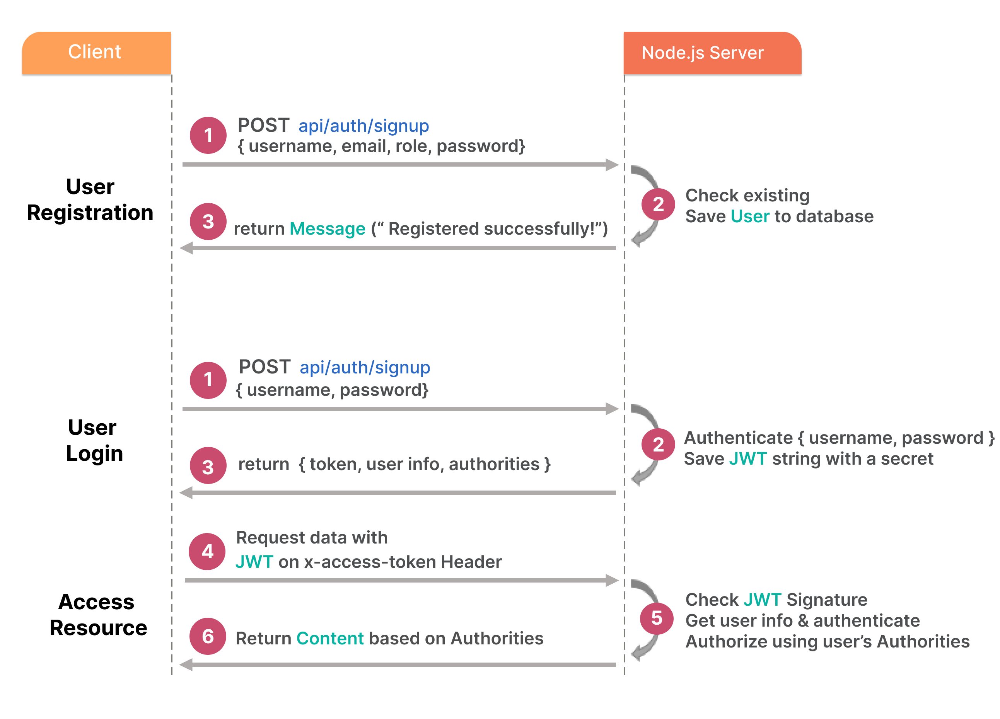
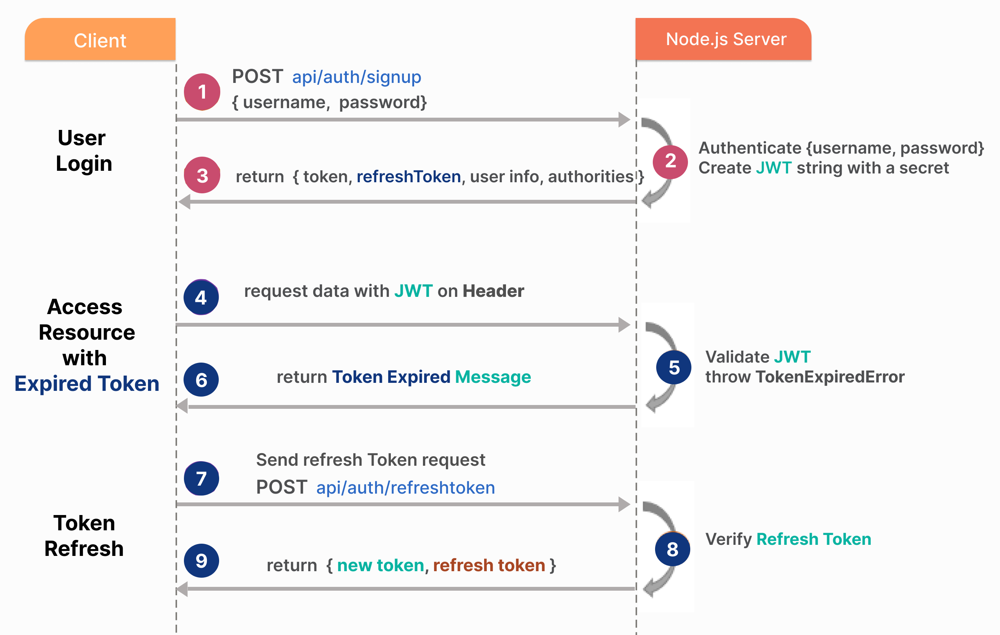

# NodeJS Auth REST API example with Express, Mysql, and JWT

## User Registration, User Login and Authorization process.

The diagram shows flow of how we implement User Registration, User Login and Authorization process.



You may need to implement Refresh Token:



## Features

1. User can sign up
2. User can sign in

## API endpoints

1. `POST /api/auth/signUp`: Creates a new user
2. `POST /api/auth/signin`: Logs in a user

## Body Payload Specification

Sign-up expects

```js
{
    firstName: string,
    lastName: string,
    email: string,
    password: string
}
```

Signin expects

```js
{
    email: string,
    password: string
}
```

## Tools

- NodeJS/Express: Server
- MySQL: Storage
- JWT: Token based authentication
- bcryptjs: Password security
- winston/morgan: Logs
- Joi: Validations

## Available scripts

- `start`: Starts the server with node
- `start:dev`: Starts the server in watch mode
- `db:up`: Creates the database
- `db:down`: Drops the database
- `tables:up`: Creates database tables
- `db:init`: Creates both the database and tables

## Getting started

You can either fork this repository or clone it by starting your terminal, then change the directory to where you would like to save it and run

```sh
git clone https://github.com/SevenSquare-Tech/Node.js-token-based-authentication-with-MySQL.git
```

Change to the newly downloaded directory with

```sh
cd Node.js-token-based-authentication-with-MySQL
```

Rename the file named `.env.example` to `.env` and update the variable values with valid ones

Install the required dependencies with

```sh
npm install
```

Initialize the database with

```sh
npm run db:init
```

Start the app with

```sh
npm start
```

You can also start it in watch mode with

```sh
npm run start:dev
```

## Folder structure

```sh
.
├── README.md
├── package-lock.json
├── package.json
└── src
    ├── app.js
    ├── config
    │   ├── db.config.init.js
    │   └── db.config.js
    ├── controllers
    │   └── auth.controller.js
    ├── database
    │   ├── queries.js
    │   └── scripts
    │       ├── dbDown.js
    │       ├── dbUp.js
    │       └── tablesUp.js
    ├── index.js
    ├── middlewares
    │   ├── asyncHandler.js
    │   ├── checkEmail.js
    │   └── validatorHandler.js
    ├── models
    │   └── user.model.js
    ├── routes
    │   └── auth.route.js
    ├── utils
    │   ├── logger.js
    │   ├── password.js
    │   ├── secrets.js
    │   └── token.js
    └── validators
        └── auth.js
```
